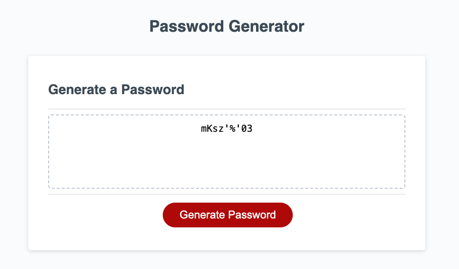

# Password Generator Application
## Objective
Develop a JavaScript application that allows users to generate a random, secure password based on their selected criteria.

## Goal
Create a browser-based application where employees can generate a secure password. The password can include a mix of lowercase, uppercase, numeric, and special characters, based on the user's choice.

## Preview

## Deployment
Visit the [Live Application](URL_placeholder)